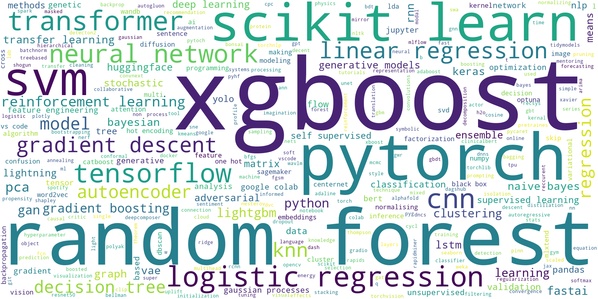

# Book-Giveaway Word Cloud


The [Back-to-school book giveaway](https://twitter.com/rasbt/status/1566073910730399745?s=20&t=7CIevGeP8cvgm1BoXR7Lmg) of a signed copy of [Machine Learning with PyTorch and Scikit-Learn](https://www.amazon.com/Machine-Learning-PyTorch-Scikit-Learn-scikit-learn-ebook-dp-B09NW48MR1/dp/B09NW48MR1/) contained a little survey question: "Your favorite machine learning technique, algorithm, or tool (1 or 2 words)".

Here is the result:





---


You can install this environment via

```
conda create -n wordcloud python=3.8

conda activate wordcloud

conda install -c conda-forge numpy matplotlib pillow \
jupyterlab watermark wordcloud pandas -y 
```

(Version details are included in the Jupyter notebook.)